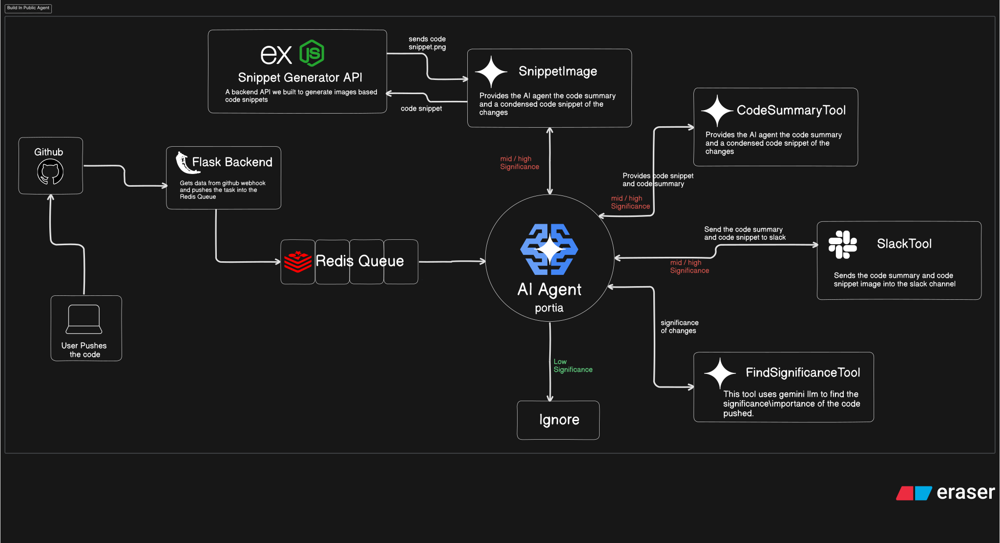
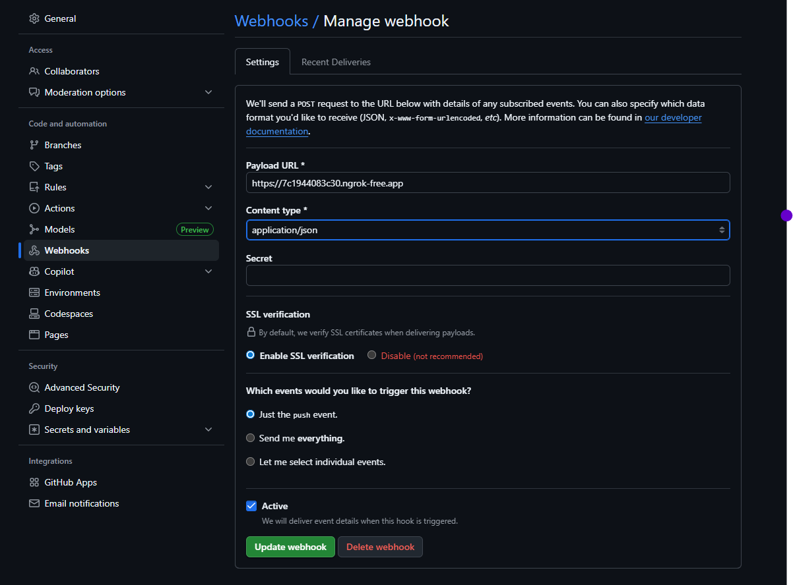

# Build In public Agent

AI agent built during AgentHack2025 hackathon by WeMakeDevs.
This Agent gets triggered by updates in the default branch of the repository and sends the code sumary and code snippet image to the slack channel only if the significance of the code changes are high enough, or else it gets ignored.

## Architechure (Agent Workflow)

## Problems Solved

- **Companies:** They can have a code changes channel where they can have all the changes updated by the developers.

- **Open Source Orgs:** They can use this to show their transperency in development by having their updates sent to public channels, where others can get these updates.

- **Solo Developers:** Devs can have their build in public work done by this AI Agent. They can also track their high significance code changes.

## How we are unique?

- This isnt your typical AI automation. This is an Agent which is intelligent enough to make it's own decisions.

- This Agent doesn't just put all your changes in the slack. It only selects those changes which have high significance. It ignores all the minor changes like comments, formatting etc.

- This also provides cool code snippet images for which we have built a backend image generator REST API.

## Tools

- **ngrok** – Expose local server for webhooks
- **GitHub Webhook** – Trigger events on code changes
- **Node.js + Express** – Handle and route incoming requests
- **Flask** – Backend logic and AI orchestration
- **Docker** – Containerize and manage services
- **Redis** – Message broker for task queue
- **RQ** – Process background jobs
- **Portia AI Agent** – Run automated AI workflows
- **OpenAI** – Text generation and processing
- **Gemini LLM** – NLP tasks and analysis
- **Perplexity AI** – Research and information retrieval
- **GPT** – Querying and summarization
- **Portia SDK** – Build/customize AI agents
- **Slack** – Notifications and communication
- **Slack SDK** – Develop Slack tools/bots
- **Puppeteer** – Generate code snippet images
- **Eraser.io** – Create workflow diagrams

## How to setup locally?

1. clone the project and create a python virtual environment in the root dir and activate it.

2. create a .env file in the root directory and fill it while referring .env.example file

3. install all the dependencies from requirements.txt

   `pip install -r requirements.txt`

4. Configure the ngrok and run a ngrok tunnel on port 3000.Then copy the link provided by ngrok and paste it in github webhook settings.
   

5. Then run a docker container with redis/redis-stack image and map port 6379 to 6379.

6. Open the img-gen-backend in another terminal and run:

   `node server.js`

7. Run server.py, worker.py and server.js in seperate terminals.

8. **Cool. You are ready to go. Happy building.**

> **Note:** For optimal performance, use API keys from a paid instance. Free-tier limits often cause interruptions due to restricted token capacity.
